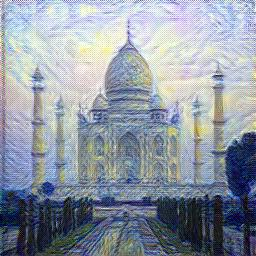

# Neural Style Transfer with MobileNetV2
- Implementation of [A Neural Algorithm of Artistic Style](https://arxiv.org/abs/1508.06576) but with [MobileNetV2](https://arxiv.org/pdf/1801.04381.pdf)/[GhostNetV2_160.in1k](https://huggingface.co/timm/ghostnetv2_160.in1k) instead of VGG.

- Based on [Neural Transfer Using PyTorch](https://pytorch.org/tutorials/advanced/neural_style_tutorial.html#neural-transfer-using-pytorch).

- Apply whiten-color-transform(WCT) algorithm to further improve performance;
- Apply channel-pruning algorithm to speed up training process without losing too much performance.

## 1. Usage
- install requirements: `pip install -r requirements.py`
- run style transfer: 
`python nst.py`
- for more options: `python nst.py --help`

## 2. Losses
- **Content Loss**: MSE Loss between feature maps at layer `L` of content image and output image.
- **Style Loss**: MSE Loss between gram matrix of feature maps at different layers of style image and output image.

### Loss Layers
Output feature maps of the following layers are used to compute the following losses:
- **Content Loss**: InvertedResidualBlock #4.
- **Style Loss**: InvertedResidualBlock #1, #2, #4, #7 and #14.

## 3. Outputs
All images are resized to `(imsize, imsize)` before processing. Here, `imsize=256` and optimized for 50 Iterations.
| Content Image       | Style Image     | Output Image(50 Itrs)     |
| :------------------ | :-------------: | ---------------: |
||| |
